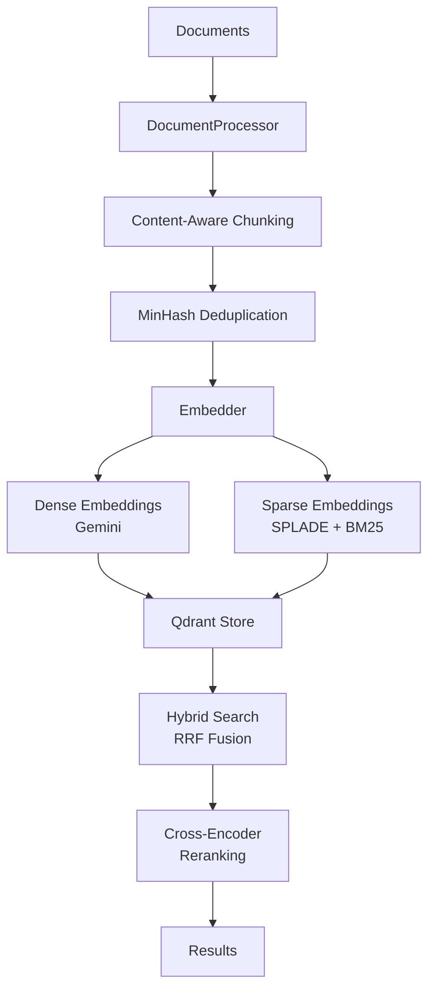

# Qdrant RAG Pipeline

High-performance Hybrid RAG (Retrieval-Augmented Generation) pipeline optimized for AMD 9950X3D + RTX 5070 Ti hardware.

## Features

### 🚀 3-Index Hybrid Search Architecture
- **Dense Vector Index**: Gemini embeddings (3072-dimensional)
- **Sparse Vector Indices**: SPLADE + BM25 for lexical matching
- **Payload Index**: Structured metadata filtering

### ⚡ Hardware Optimization
- GPU-accelerated embeddings via ONNX Runtime
- INT8 quantization with automatic rescoring
- Parallel processing with thread/process pools
- Adaptive resource throttling based on temperature/usage

### 📄 Content-Aware Processing
- Code files: Language-specific AST-aware splitting
- HTML/XML: Structure-preserving block extraction
- Documents: Semantic splitting with layout preservation
- MinHash LSH deduplication (85% similarity threshold)

## Installation

### Prerequisites
- Python 3.9+
- NVIDIA GPU with CUDA support (optional but recommended)
- Docker for Qdrant database
- 16GB+ RAM recommended

### Quick Start

1. **Clone and Install**
```bash
git clone <repo-url>
cd qdrant-rag
./install.sh  # CachyOS/Arch Linux optimized
```

For other distributions:
```bash
python -m venv .venv
source .venv/bin/activate
pip install -e ".[dev]"
```

2. **Configure API Keys**
```bash
cp .env.example .env
# Edit .env and add your GOOGLE_API_KEY
```

3. **Start Qdrant Database**
```bash
make start-qdrant
```

## Usage

### Command Line Interface

The script auto-activates its virtual environment and loads `.env` automatically:

**Ingest Documents**
```bash
./qdrant_rag.py ingest --source /path/to/documents
# or
make ingest src=/path/to/documents
```

**Search**
```bash
./qdrant_rag.py search --query "your search query" --limit 10
# or
make search query="your search query"
```

**Benchmark Quantization**
```bash
./qdrant_rag.py evaluate-quantization --source /path/to/samples --queries-file queries.json
# or
make evaluate-quantization src=/path/to/samples
```

### Python API

```python
import asyncio
from qdrant_rag import MaxPerformancePipeline

# Initialize pipeline
pipeline = MaxPerformancePipeline()

# Ingest documents
async def ingest_docs():
    await pipeline.ingest("/path/to/documents")

asyncio.run(ingest_docs())

# Search
results = pipeline.search("How to implement RAG?", limit=5)
for result in results:
    print(f"Score: {result['score']:.2f}")
    print(f"Text: {result['text'][:200]}...")
    print(f"Source: {result['metadata']['source']}")
    print("---")

# Clean up
pipeline.close()
```

## Configuration

### Environment Variables

| Variable | Description | Default |
|----------|-------------|---------|
| `GOOGLE_API_KEY` | Gemini API key (required) | - |
| `QDRANT_URL` | Qdrant database URL | `http://localhost:6333` |
| `EMBEDDING_MODEL` | Gemini embedding model | `gemini-embedding-001` |
| `UNSTRUCTURED_STRATEGY` | Document parsing strategy (`hi_res`/`fast`) | `hi_res` |
| `RERANKER_MODEL` | Cross-encoder model for reranking | `BAAI/bge-reranker-v2-m3` |
| `MAX_CPU_TEMP` | CPU temperature throttle threshold (°C) | `85` |
| `MAX_GPU_TEMP` | GPU temperature throttle threshold (°C) | `83` |

### Supported File Types

- **Code**: `.py`, `.js`, `.java`, `.cpp`, `.c`, `.h`, `.rs`, `.go`
- **Markup**: `.html`, `.htm`, `.xhtml`, `.xml`, `.svg`
- **Documents**: `.pdf`, `.docx`, `.txt`, `.md`, `.rst`, and more via Unstructured

## Development

### Development Commands

This project uses a Makefile for task management. After setting up the project, you can use:

```bash
# Linting and formatting
make format      # Format all code with ruff
make lint        # Lint and auto-fix issues
make typecheck   # Run mypy type checking
make check       # Run both lint and typecheck

# Testing
make test        # Run tests
make test-cov    # Run tests with coverage report

# Development
make docs        # Generate documentation
make clean       # Clean cache and temporary files

# Quality assurance
make qa          # Run format, check, and test
make build       # Build distribution packages
```

### Manual Commands
```bash
# If you prefer running commands directly:
ruff format qdrant_rag.py    # Format code
ruff check qdrant_rag.py     # Lint
mypy qdrant_rag.py           # Type check
pytest tests/                 # Run tests
```

### Project Structure
```
qdrant-rag/
├── qdrant_rag.py       # Main pipeline implementation
├── setup.py            # Package setup
├── pyproject.toml      # Project configuration
├── install.sh          # Installation script
├── Makefile           # Convenience commands
├── .env.example       # Environment template
└── README.md          # This file
```

## Performance

### Benchmarks
- **Ingestion**: ~100 documents/second (varies by document type)
- **Search Latency**: <100ms for hybrid search (cached embeddings)
- **INT8 Quantization Recall**: >95% recall@10 typical

### Resource Usage
- **CPU**: Adaptive throttling at 80% usage
- **Memory**: Throttles at 70% usage or <4GB free
- **Temperature**: Auto-throttles based on CPU/GPU temps

## Architecture



## Contributing

Pull requests are welcome! Please ensure:
1. Code passes `ruff check` and `mypy`
2. Documentation is updated
3. Tests are added for new features

## License

[Add your license here]

## Acknowledgments

- Built with Qdrant vector database
- Uses Google Gemini for embeddings
- Powered by LlamaIndex and Unstructured