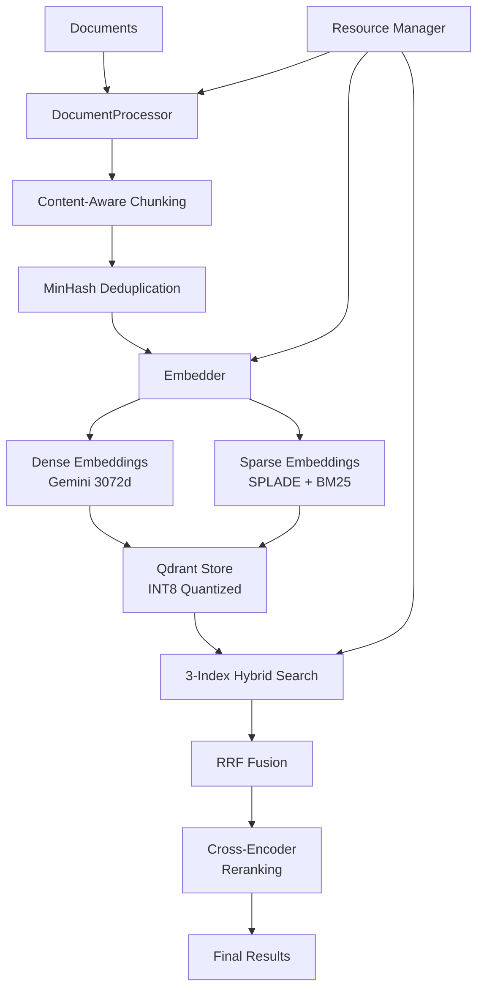

# Qdrant RAG Pipeline

High-performance Hybrid RAG (Retrieval-Augmented Generation) pipeline optimized for AMD 9950X3D + RTX 5070 Ti hardware, implementing a sophisticated 3-index hybrid search architecture with GPU acceleration.

## Table of Contents

- [Features](#features)
- [System Requirements](#system-requirements)
- [Installation](#installation)
  - [Quick Start](#quick-start)
  - [Detailed Installation](#detailed-installation)
  - [Manual Installation](#manual-installation)
- [Configuration](#configuration)
- [Usage](#usage)
  - [Command Line Interface](#command-line-interface)
  - [Python API](#python-api)
- [Architecture](#architecture)
- [Development](#development)
- [Performance](#performance)
- [Troubleshooting](#troubleshooting)
- [Contributing](#contributing)
- [License](#license)

## Features

### 🚀 3-Index Hybrid Search Architecture
- **Dense Vector Index**: 3072-dimensional Gemini text-embedding-004 embeddings for semantic search
- **Sparse Vector Indices**: SPLADE + BM25 for lexical matching
- **Payload Index**: Structured metadata filtering (file types, dates, sources)

### ⚡ Hardware Optimization
- GPU-accelerated embeddings via ONNX Runtime with CUDA provider
- INT8 quantization with automatic rescoring (75% memory reduction, >95% recall)
- Parallel processing with configurable thread/process pools
- Dynamic resource throttling based on CPU/GPU temperature and usage
- MinHash LSH deduplication (85% similarity threshold)

### 📄 Content-Aware Processing
- **Code files**: Language-specific AST-aware splitting preserving structure
- **HTML/XML**: Structure-preserving block extraction
- **Documents**: Semantic splitting with layout preservation
- **Automatic deduplication**: Using MinHash LSH algorithm

### 🔧 Enterprise Features
- Auto-activation virtual environment (no manual activation needed)
- Automatic `.env` loading
- Comprehensive hardware monitoring
- Production-ready Docker deployment with GPU support
- Extensive logging and error handling

## System Requirements

### Hardware (Recommended)
- **CPU**: 8+ cores (optimized for AMD 9950X3D)
- **GPU**: NVIDIA GPU with 8GB+ VRAM and CUDA 11.8+ support
- **RAM**: 16GB minimum, 32GB+ recommended
- **Storage**: NVMe SSD recommended for vector database

### Software
- **OS**: Linux (optimized for Arch/CachyOS), macOS, or Windows with WSL2
- **Python**: 3.9 or higher
- **Docker**: For running Qdrant database
- **CUDA**: 11.8 or higher (for GPU acceleration)

## Installation

### Quick Start

#### For Arch Linux/CachyOS (Automated)

```bash
# 1. Clone the repository
git clone <repo-url>
cd qdrant-rag

# 2. Install system dependencies (Docker, CUDA, uv, etc.)
make installdeps
# Note: You'll be added to docker group - logout and login again after this step

# 3. Install Python environment (after logging back in)
make install
# Choose option 2 for full GPU-accelerated installation

# 4. Configure environment
cp .env.example .env
# Edit .env and add your GOOGLE_API_KEY (required for Gemini embeddings)

# 5. Verify installation
make verify

# 6. Start Qdrant database
make start-qdrant
```

#### For Other Linux Distributions

```bash
# 1. Install system dependencies manually
# - Docker with NVIDIA Container Toolkit
# - NVIDIA drivers and CUDA toolkit
# - Python 3.9+
# - System libraries: libxml2-dev libxslt-dev poppler-utils tesseract-ocr

# 2. Clone and setup
git clone <repo-url>
cd qdrant-rag

# 3. Create virtual environment and install
python3 -m venv .venv
source .venv/bin/activate
pip install -e ".[dev]"

# 4. Install PyTorch with CUDA support
pip install torch torchvision --index-url https://download.pytorch.org/whl/cu121

# 5. Configure and start
cp .env.example .env
# Edit .env with your API keys
make start-qdrant
```

### Detailed Installation

#### Installation Targets

**`make installdeps`** - System-level dependencies (Arch Linux only)
- Installs uv (fast Python package manager)
- Docker with GPU support and NVIDIA Container Toolkit
- NVIDIA drivers and CUDA toolkit
- Document processing libraries (poppler, tesseract)
- Hardware monitoring tools (htop, nvtop, lm_sensors)

**`make install`** - Python environment setup
- Creates virtual environment at `.venv`
- Installs development tools (ruff, mypy, pytest)
- Installs all Python dependencies including GPU packages
- Uses `uv` if available for 10x faster installation

**`make verify`** - Installation verification
- Checks Python environment status
- Verifies GPU/CUDA availability
- Tests Docker configuration
- Validates Qdrant container status
- Checks configuration files

### Manual Installation

#### Installing uv (Optional but Recommended)

```bash
curl -LsSf https://astral.sh/uv/install.sh | sh
export PATH="$HOME/.local/bin:$PATH"
```

#### Docker GPU Support

For NVIDIA GPU support in Docker:

```bash
# Install NVIDIA Container Toolkit
distribution=$(. /etc/os-release;echo $ID$VERSION_ID)
curl -s -L https://nvidia.github.io/nvidia-docker/gpgkey | sudo apt-key add -
curl -s -L https://nvidia.github.io/nvidia-docker/$distribution/nvidia-docker.list | \
    sudo tee /etc/apt/sources.list.d/nvidia-docker.list

sudo apt-get update
sudo apt-get install -y nvidia-container-toolkit
sudo systemctl restart docker

# Add user to docker group
sudo usermod -aG docker $USER
# Logout and login again for group changes to take effect
```

## Configuration

### Environment Variables

Create a `.env` file from the template:

```bash
cp .env.example .env
```

Required and optional environment variables:

| Variable | Description | Default | Required |
|----------|-------------|---------|----------|
| `GOOGLE_API_KEY` | Google Gemini API key for embeddings | - | ✅ Yes |
| `QDRANT_URL` | Qdrant database URL | `http://localhost:6333` | No |
| `QDRANT_API_KEY` | Qdrant API key (for production) | - | No |
| `EMBEDDING_MODEL` | Gemini embedding model | `text-embedding-004` | No |
| `RERANKER_MODEL` | Cross-encoder for reranking | `ms-marco-MiniLM-L-12-v2` | No |
| `UNSTRUCTURED_STRATEGY` | Document parsing (`hi_res`/`fast`) | `hi_res` | No |
| `CPU_THROTTLE_TEMP` | CPU temperature throttle (°C) | `80` | No |
| `GPU_THROTTLE_TEMP` | GPU temperature throttle (°C) | `75` | No |
| `MAX_CPU_USAGE` | Max CPU usage before throttling (%) | `80` | No |
| `MAX_MEMORY_USAGE` | Max memory usage before throttling (%) | `70` | No |
| `MIN_FREE_MEMORY_GB` | Minimum free memory (GB) | `4` | No |

### Supported File Types

- **Code**: `.py`, `.js`, `.java`, `.cpp`, `.c`, `.h`, `.rs`, `.go`, `.ts`, `.jsx`, `.tsx`
- **Markup**: `.html`, `.htm`, `.xhtml`, `.xml`, `.svg`
- **Documents**: `.pdf`, `.docx`, `.txt`, `.md`, `.rst`, `.tex`, `.odt`
- **Data**: `.json`, `.yaml`, `.yml`, `.csv`, `.tsv`

## Usage

### Command Line Interface

The script **automatically activates** its virtual environment and loads `.env` - no manual activation needed!

#### Document Ingestion

```bash
# Direct execution (auto-activates venv)
./qdrant_rag.py ingest --source /path/to/documents

# Or using make
make ingest src=/path/to/documents

# With options
./qdrant_rag.py ingest \
    --source /path/to/documents \
    --collection my_collection \
    --batch-size 32
```

#### Hybrid Search

```bash
# Basic search
./qdrant_rag.py search --query "How to implement RAG?" --limit 10

# Or using make
make search query="How to implement RAG?" limit=10

# Advanced search with filters
./qdrant_rag.py search \
    --query "vector database optimization" \
    --limit 5 \
    --collection my_collection \
    --rerank
```

#### Quantization Evaluation

```bash
# Benchmark INT8 quantization performance
./qdrant_rag.py evaluate-quantization \
    --source /path/to/test-docs \
    --queries-file queries.json

# Or using make
make evaluate-quantization src=/path/to/test-docs
```

### Python API

```python
import asyncio
from qdrant_rag import MaxPerformancePipeline

# Initialize pipeline with configuration
pipeline = MaxPerformancePipeline(
    collection_name="my_documents",
    embedding_model="text-embedding-004",
    use_gpu=True
)

# Async document ingestion
async def ingest_documents():
    """Ingest documents with progress tracking."""
    await pipeline.ingest(
        source_path="/path/to/documents",
        batch_size=32,
        show_progress=True
    )

asyncio.run(ingest_documents())

# Synchronous search
results = pipeline.search(
    query="How to implement vector search?",
    limit=5,
    rerank=True,
    filters={
        "file_type": "pdf",
        "date_created": {"$gte": "2024-01-01"}
    }
)

# Process results
for i, result in enumerate(results, 1):
    print(f"\n--- Result {i} ---")
    print(f"Score: {result['score']:.4f}")
    print(f"Text: {result['text'][:500]}...")
    print(f"Source: {result['metadata']['source']}")
    print(f"Page: {result['metadata'].get('page', 'N/A')}")

# Cleanup
pipeline.close()
```

## Architecture

### System Overview



### Core Components

#### MaxPerformancePipeline
Main orchestrator managing the entire RAG pipeline with:
- Automatic virtual environment activation
- Configuration management
- Pipeline coordination
- Error handling and recovery

#### Embedder
GPU-accelerated embedding generation:
- Gemini API for dense embeddings (3072 dimensions)
- SPLADE for learned sparse representations
- BM25 for traditional lexical matching
- Batch processing with automatic sizing
- ONNX Runtime optimization

#### DocumentProcessor
Intelligent document processing:
- AST-aware code splitting (preserves functions/classes)
- HTML/XML structure preservation
- Semantic text chunking with overlap
- MinHash LSH deduplication
- Metadata extraction

#### QdrantStore
Vector database operations:
- INT8 quantization with scalar rescoring
- Multi-index management
- Hybrid search with configurable weights
- Payload filtering
- Batch operations with retries

#### SystemResourceManager
Hardware monitoring and throttling:
- Real-time CPU/GPU temperature monitoring
- Memory usage tracking
- Dynamic batch size adjustment
- Thermal throttling
- Process priority management

## Development

### Development Commands

```bash
# Code Quality
make format         # Format code with ruff
make lint          # Lint and auto-fix issues
make typecheck     # Run mypy type checking
make check         # Run both lint and typecheck
make qa            # Full quality assurance (format + check + test)

# Testing
make test          # Run test suite
make test-cov      # Run tests with coverage report

# Documentation
make docs          # Generate API documentation

# Validation
make validate      # Comprehensive validation of all files
make verify        # Verify installation and GPU support

# Building
make build         # Build distribution packages

# Cleanup
make clean         # Remove generated files and cache
```

### Docker Operations

```bash
# Qdrant Management
make setup-qdrant   # Create directories and config
make start-qdrant   # Start Qdrant with GPU support
make stop-qdrant    # Stop and remove container
make logs-qdrant    # View container logs
```

### Project Structure

```
qdrant-rag/
├── qdrant_rag.py          # Main pipeline implementation (~1200 lines)
├── pyproject.toml         # Project configuration and dependencies
├── setup.py               # Package setup for pip installation
├── Makefile              # Task automation and workflows
├── .env.example          # Environment template
├── .env                  # Local configuration (git-ignored)
├── qdrant_data/          # Qdrant database storage (created)
├── qdrant_config/        # Qdrant configuration (created)
├── .venv/                # Virtual environment (created)
└── README.md             # This documentation
```

## Performance

### Benchmarks

Performance metrics on reference hardware (RTX 5070 Ti + AMD 9950X3D):

| Operation | Throughput | Latency | Notes |
|-----------|------------|---------|-------|
| Document Ingestion | ~100 docs/sec | - | Varies by document size and type |
| Embedding Generation | ~500 chunks/sec | <20ms/chunk | With GPU acceleration |
| Vector Search | - | <50ms | 1M vectors, cached |
| Hybrid Search | - | <100ms | With reranking |
| INT8 Quantization | - | - | 75% memory reduction, >95% recall@10 |

### Resource Usage

- **CPU Usage**: Throttles at 80% utilization
- **Memory**: Throttles at 70% usage or <4GB free
- **Temperature**: Auto-throttles (CPU: 80°C, GPU: 75°C)
- **GPU Memory**: ~2GB for embeddings, varies with batch size

### Optimization Tips

1. **Batch Size**: Adjust based on GPU memory (default: 32)
2. **Quantization**: Enable INT8 for large collections
3. **Threading**: Set based on CPU cores (default: auto)
4. **Caching**: Enable embedding cache for repeated queries
5. **Deduplication**: Tune similarity threshold (default: 0.85)

## Troubleshooting

### Common Issues

#### Docker Permission Denied

```bash
# Add user to docker group
sudo usermod -aG docker $USER
# Logout and login again for changes to take effect
```

#### GPU Not Detected

```bash
# Check NVIDIA drivers
nvidia-smi

# Verify CUDA installation
nvcc --version

# Reinstall with GPU support
make install  # Choose option 2 for full GPU installation

# Check PyTorch CUDA
python -c "import torch; print(torch.cuda.is_available())"
```

#### Missing Dependencies

```bash
# For uv package manager
curl -LsSf https://astral.sh/uv/install.sh | sh
export PATH="$HOME/.local/bin:$PATH"

# For system libraries (Ubuntu/Debian)
sudo apt-get install libxml2-dev libxslt-dev poppler-utils tesseract-ocr
```

#### Qdrant Connection Issues

```bash
# Check if container is running
docker ps | grep qdrant

# View logs
make logs-qdrant

# Restart container
make stop-qdrant
make start-qdrant
```

#### Virtual Environment Issues

```bash
# Clean and reinstall
make clean
make install

# Manual activation (if auto-activation fails)
source .venv/bin/activate
```

### Environment-Specific Notes

#### WSL2 (Windows)
- Ensure WSL2 is using Ubuntu 22.04 or newer
- Install CUDA toolkit in WSL2 environment
- Enable systemd for Docker support

#### macOS
- GPU acceleration not supported (CPU only)
- Use Docker Desktop for Qdrant
- Install poppler via Homebrew: `brew install poppler tesseract`

#### Non-Arch Linux
- Install system dependencies manually
- Refer to distribution-specific package names
- Docker GPU support may require additional configuration

## Contributing

Contributions are welcome! Please ensure:

1. Code passes all quality checks:
   ```bash
   make qa  # Runs format, lint, typecheck, and tests
   ```

2. Documentation is updated for new features

3. Tests are added for new functionality

4. Commit messages follow conventional commits format

### Development Setup

```bash
# Fork and clone the repository
git clone https://github.com/yourusername/qdrant-rag.git
cd qdrant-rag

# Create a feature branch
git checkout -b feature/your-feature-name

# Install in development mode
make install  # Choose option 2 for full installation

# Make your changes and test
make qa

# Submit a pull request
```

## License

[Specify your license here]

## Acknowledgments

- Built on [Qdrant](https://qdrant.tech/) vector database with GPU acceleration
- Uses [Google Gemini](https://ai.google.dev/) for state-of-the-art embeddings
- Powered by [LlamaIndex](https://www.llamaindex.ai/) for RAG orchestration
- Document processing via [Unstructured](https://unstructured.io/)
- GPU acceleration through [ONNX Runtime](https://onnxruntime.ai/)